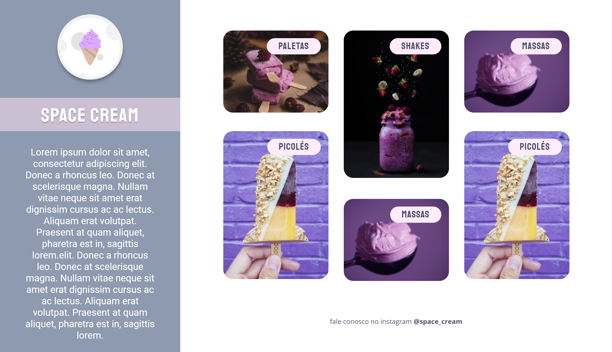

# Space Cream

A proposta é criar um site responsivo e dinâmico, que se adapte a diferentes telas e um layout utilizando Grid
 

Desafio proposto no encerramento do stage 03 do curso Explorer da RocketSeat

[Clique aqui para acessar](https://caiogvm.github.io/space_cream)

## ⚙ Ferramentas
- HTML
- CSS

## 📚 O que eu aprendi
- Responsividade com Media Queries
- Grid Layout
- Animações com Keyframes

## 📞 Contatos

caiovalim12@gmail.com

[LinkedIn](https://linkedin.com/in/caiovalim)